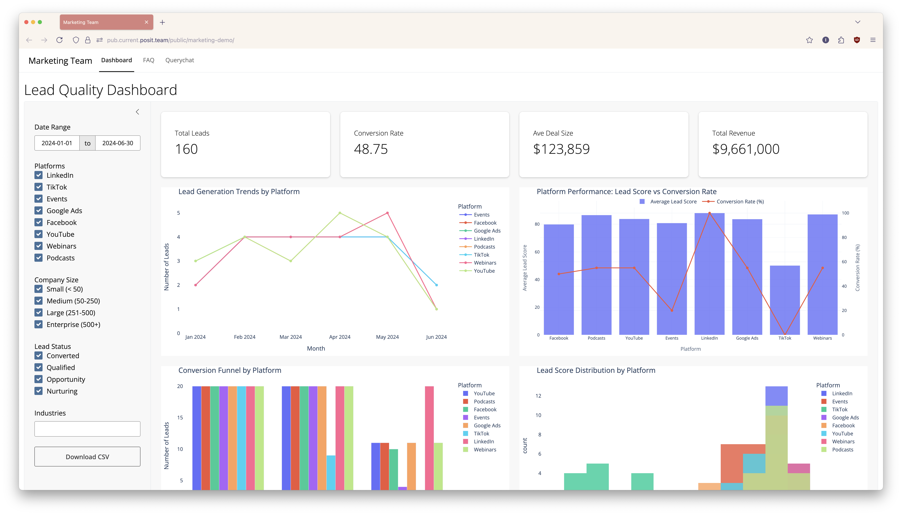

# Build Automated, Tailored Marketing Dashboards for Optimized Marketing Spend 

## End-to-end workflow with Posit Team, May 2024

---

Welcome to the GitHub repository for the slides showcased in Posit's "End-to-End Workflow with Posit Team" webinar in June 2025.

## Demo Resources

* [Link to slides](https://ivelasq-2025-06-25-marketing-demo.share.connect.posit.cloud/)
* [Marketing dashboard](https://pub.current.posit.team/public/marketing-demo/)
* [Marketing dashboard GitHub Repo](https://github.com/posit-marketing/marketing-dashboard)

## Workflow Resources

* [Data Science Workflows with Posit Tools - R focus](https://posit-conf-2024.github.io/ds-workflows-r/)
* [Data Science Workflows with Posit Tools - Python focus](https://github.com/posit-conf-2024/ds-workflows-python)
  * Join us in September to join one of these workshops live at posit::conf(2025)! [pos.it/conf](https://pos.it/conf)
* [Best Practices in Working with Databases](https://solutions.posit.co/connections/db/)

## Posit Team

* [Posit Team](https://posit.co/products/enterprise/team/)
* [Posit Professional Drivers](https://solutions.posit.co/connections/db/databases/?_gl=1*dvoc14*_up*MQ..*_ga*MTQwNDcyMTk0OC4xNzUwNjg4Mjkw*_ga_X64JZVV9NC*czE3NTA2ODgyODkkbzEkZzAkdDE3NTA2ODgyODkkajYwJGwwJGgw)

## Data Validation

* [Pointblank (Python)](https://posit-dev.github.io/pointblank/)
* [Pointblank (R)](https://rstudio.github.io/pointblank/)

## Shiny

* [Get started with Shiny](https://shiny.posit.co/getstarted)
* [Querychat](https://github.com/posit-dev/querychat)
* [Creating a Shiny app that interacts with a database](https://posit.co/blog/shiny-with-databases/)
